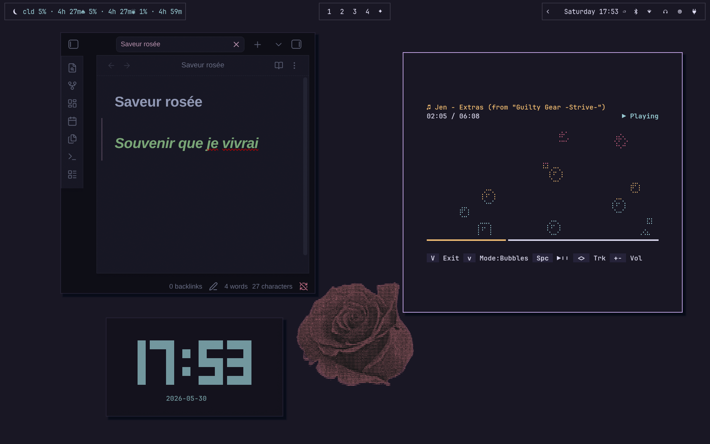

# Saveur Roseé ~🌸
_A Rosé flavoured minimal theme for [Omarchy](https://omarchy.org/)._


This theme aims for comfort, simplicity and beauty. 

Made with [Aether](https://github.com/bjarneo/aether) with animations based on [HANCORE](https://github.com/HANCORE-linux)'s themes.



---

## Installation ⭐
Install it easily via **Omarchy Menu**!
> Omarchy Menu > Install > Style > Theme > Paste: `https://github.com/JoJowAkaGioGiow/omarchy-saveur-rosee-theme.git`

Or choose a quicker installation via **Terminal**
```
omarchy-theme-install https://github.com/JoJowAkaGioGiow/omarchy-saveur-rosee-theme.git
``` 
And done! .𖥔 

---

## Recomendations 🌙
- For **Obsidian**: Use the [AnuPpuccin](https://github.com/AnubisNekhet/AnuPpuccin) theme with the [Style Settings](https://github.com/obsidian-community/obsidian-style-settings) plugin.
- Search for [Rosé Pine](https://rosepinetheme.com/) themes for other IDEs and software.

## Extensive links
- https://omarchy.org/
- https://github.com/bjarneo/aether
- https://github.com/HANCORE-linux
- https://github.com/AnubisNekhet/AnuPpuccin
- https://rosepinetheme.com/
